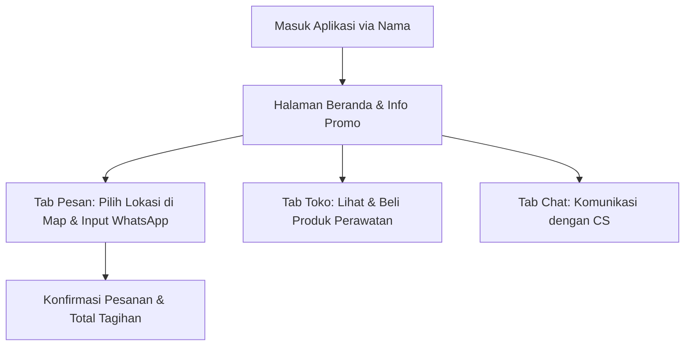
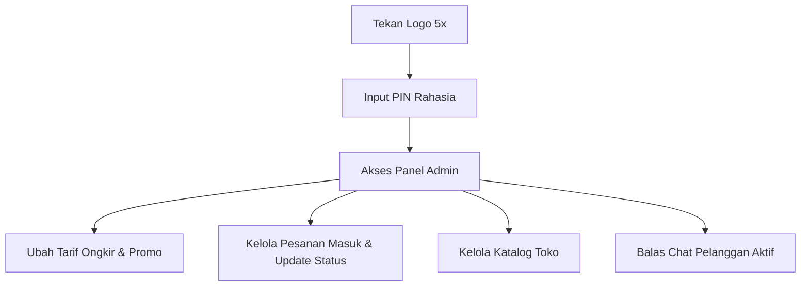

# Product Requirements Document (PRD) - ER Motowash

## 1. Project Information
* **Nama Proyek:** ER Motowash
* **Tipe Proyek:** Web Application (On-Demand Motorcycle Wash & Delivery Service)
* **Status:** Fase Desain & Spesifikasi Sistem (Migrasi Prototipe ke Production Stack)
* **Bahasa Utama:** Indonesia

---

## 2. Executive Summary
ER Motowash adalah platform pemesanan jasa cuci motor on-demand berbasis antar-jemput. Aplikasi ini memungkinkan pengguna untuk memesan pencucian motor langsung dari rumah/lokasi mereka dengan penentuan lokasi presisi menggunakan peta interaktif (Leaflet). Selain jasa cuci, platform ini juga menyediakan toko online produk perawatan motor (*motor care products*) dan fitur komunikasi langsung (*Live Chat*) dengan Customer Service. 

Proyek ini bertujuan untuk melakukan modernisasi teknologi dari prototipe berbasis *Single Page HTML/Vanilla JS* ke arsitektur modern berbasis **Next.js**, **TypeScript**, dan **Supabase**.

---

## 3. Background
Meningkatnya populasi kendaraan roda dua berbanding lurus dengan kebutuhan perawatan kendaraan, khususnya cuci motor. Namun, banyak pemilik motor yang tidak memiliki waktu luang atau enggan mengantre di tempat pencucian konvensional. Konsep cuci motor antar-jemput (on-demand motowash) menawarkan kepraktisan tinggi karena motor akan dijemput, dicuci di basecamp ER Motowash, dan diantar kembali ke pelanggan dalam kondisi bersih.

---

## 4. Problem Statement
1. **Ketidakpastian Lokasi:** Kesulitan dalam menentukan lokasi penjemputan motor secara presisi jika hanya menggunakan pesan teks/alamat manual.
2. **Kalkulasi Biaya Transparan:** Pelanggan membutuhkan kepastian jarak dan ongkos kirim (antar-jemput) sebelum menyetujui pesanan.
3. **Komunikasi CS Terpusat:** Penanganan chat pelanggan via berbagai saluran (WhatsApp, Instagram, dll.) sering kali tidak terorganisir dengan baik untuk Admin.
4. **Manajemen Produk Tambahan:** Kurangnya wadah bagi pelanggan untuk membeli produk pendukung perawatan motor secara langsung saat bertransaksi.

---

## 5. Goals & Objectives
* **Goals:** 
  Membangun platform on-demand cuci motor antar-jemput yang andal, transparan, dan terintegrasi untuk memperluas jangkauan operasional ER Motowash.
* **Objectives:**
  * Memungkinkan pelanggan memesan layanan cuci motor dalam waktu kurang dari 2 menit.
  * Menyediakan fitur kalkulasi jarak otomatis berbasis peta (Leaflet) dan ongkos kirim dinamis.
  * Menyediakan modul admin terintegrasi untuk memantau status pesanan, memproses live chat pelanggan, dan mengelola stok produk toko perawatan.

---

## 6. Success Metrics
* **User Engagement:** > 80% pesanan masuk berhasil diselesaikan tanpa kendala miskomunikasi lokasi.
* **Operational Efficiency:** Waktu respons admin terhadap live chat pelanggan di bawah 3 menit.
* **Order Conversion:** Peningkatan penjualan produk perawatan motor (*upselling*) melalui fitur Toko terintegrasi.
* **System Reliability:** Aplikasi memiliki tingkat uptime 99.9% dan beban muat halaman di bawah 2 detik.

---

## 7. Stakeholders & User Roles
1. **Pelanggan (Customer):**
   * Mendaftar/masuk dengan nama panggilan sederhana.
   * Menentukan lokasi penjemputan melalui pin map.
   * Melakukan pemesanan cuci motor dan memantau statusnya.
   * Membeli produk perawatan motor.
   * Melakukan Live Chat dengan Admin/CS.
2. **Admin/Customer Service (CS):**
   * Mengakses Panel Admin yang dilindungi PIN.
   * Mengatur tarif ongkir per 100 meter dan konten promo beranda.
   * Memantau, memperbarui status, atau membatalkan pesanan masuk.
   * Mengelola produk toko (tambah, edit, hapus).
   * Membalas Live Chat dari semua pelanggan secara terpusat.

---

## 8. User Journey

### A. Pelanggan


### B. Admin


---

## 9. Functional Requirements

### Pelanggan
* **FR-01 (Authentication):** Pengguna dapat masuk menggunakan nama panggilan (disimpan di LocalStorage/Session).
* **FR-02 (Interactive Maps):** Menentukan koordinat lokasi motor menggunakan Leaflet JS dengan pin yang dapat digeser (drag-and-drop) atau diklik.
* **FR-03 (Distance Calculation):** Menghitung jarak rute secara real-time dari basecamp (-7.01065, 106.57877) ke titik jemput.
* **FR-04 (Cost Calculator):** Menampilkan ongkos kirim berdasarkan jarak (misalnya, gratis untuk 500 meter pertama, selanjutnya dikenakan tarif per 100 meter) beserta total tagihan.
* **FR-05 (Order History):** Menampilkan daftar pesanan aktif milik pengguna berserta statusnya (*Pending, Diambil, Dicuci, Diantar, Selesai, Dibatalkan*).
* **FR-06 (E-Commerce Catalog):** Menampilkan daftar produk perawatan motor yang tersedia dengan deskripsi dan harga.
* **FR-07 (Live Chat):** Berinteraksi secara real-time dengan Admin/CS.

### Admin
* **FR-08 (Admin Gatekeeping):** Akses Panel Admin disembunyikan (masuk via trik klik logo) dan wajib memasukkan PIN keamanan.
* **FR-09 (System Config):** Mengubah tarif ongkir per 100 meter tambahan dan mengubah tipe promo di beranda (teks kustom vs gambar default).
* **FR-10 (Order Management):** Melihat seluruh pesanan masuk secara real-time, mengubah status pesanan (*Update Status*), atau membatalkan pesanan.
* **FR-11 (Inventory Management):** Menambah, memperbarui, atau menghapus produk di katalog toko perawatan motor.
* **FR-12 (Centralized Chat Room):** Melihat daftar kontak pelanggan yang sedang aktif mengirim pesan dan membalas chat secara real-time.

---

## 10. Non-Functional Requirements
* **NFR-01 (Performance):** Aplikasi harus responsif pada perangkat mobile (Mobile-First Design) dengan transisi mulus.
* **NFR-02 (Scalability):** Migrasi ke Next.js & Supabase untuk memisahkan logika front-end dengan database production secara tangguh.
* **NFR-03 (Real-time Database Sync):** Perubahan data pesanan, chat, dan produk harus ter-sinkronisasi secara real-time tanpa perlu refresh halaman manual.
* **NFR-04 (Security):** Autentikasi admin yang aman di sisi server menggunakan token (tidak hanya hardcoded PIN di client-side JS untuk versi production).

---

## 11. Tech Stack & Architecture

### Tech Stack
- Next.js 16
- TypeScript
- Tailwind CSS
- shadcn/ui
- Supabase
- PostgreSQL
- Zustand
- TanStack Query
- React Hook Form + Zod
- Leaflet
- Recharts
- Vercel

### Peran Komponen Tech Stack
* **Framework & Bahasa:** Next.js 16 dengan TypeScript untuk pengembangan aplikasi web yang type-safe dan performan.
* **UI & Styling:** Tailwind CSS dan shadcn/ui untuk desain antarmuka modern, responsif, dan konsisten.
* **State Management & Data Fetching:** Zustand untuk state lokal/global yang ringan, serta TanStack Query untuk caching dan sinkronisasi data server.
* **Form & Validasi:** React Hook Form bersama Zod untuk manajemen form dan validasi input yang aman.
* **Database & Realtime:** Supabase (dengan PostgreSQL) untuk database relasional, sinkronisasi data real-time (pesanan & chat), serta manajemen autentikasi.
* **Peta & Visualisasi:** Leaflet untuk modul peta interaktif pelacak lokasi jemput, dan Recharts untuk visualisasi grafik laporan di dashboard admin.
* **Hosting:** Vercel untuk deployment yang cepat dan andal.

---

## 12. Database Schema (Rencana Tabel Supabase)

### 1. `users`
* `id` (UUID, Primary Key)
* `name` (VARCHAR)
* `role` (VARCHAR: 'customer' | 'admin')
* `created_at` (TIMESTAMP)

### 2. `orders`
* `id` (UUID, Primary Key)
* `customer_name` (VARCHAR)
* `phone` (VARCHAR)
* `address_detail` (TEXT)
* `latitude` (NUMERIC)
* `longitude` (NUMERIC)
* `distance_km` (NUMERIC)
* `shipping_cost` (INTEGER)
* `wash_cost` (INTEGER)
* `total_cost` (INTEGER)
* `status` (VARCHAR: 'pending' | 'diambil' | 'dicuci' | 'diantar' | 'selesai' | 'dibatalkan')
* `created_at` (TIMESTAMP)

### 3. `products`
* `id` (UUID, Primary Key)
* `name` (VARCHAR)
* `price` (INTEGER)
* `description` (TEXT)
* `image_url` (TEXT)
* `created_at` (TIMESTAMP)

### 4. `chats` / `messages`
* `id` (UUID, Primary Key)
* `room_id` (VARCHAR / nama customer)
* `sender` (VARCHAR / 'customer' | 'admin')
* `message` (TEXT)
* `created_at` (TIMESTAMP)

### 5. `settings`
* `key` (VARCHAR, Primary Key)
* `value` (JSONB)
* `updated_at` (TIMESTAMP)

---

## 13. Folder Structure (Next.js Target)
```text
ermotowash-app/
├── src/
│   ├── app/
│   │   ├── layout.tsx
│   │   ├── page.tsx          # Beranda & Login
│   │   ├── pesanan/          # Alur Pemesanan
│   │   ├── toko/             # E-commerce katalog
│   │   ├── chat/             # Ruang live chat
│   │   └── admin/            # Dashboard Admin & Konfigurasi
│   ├── components/
│   │   ├── ui/               # shadcn/ui components
│   │   └── shared/           # Header, Nav, MapComponent
│   ├── hooks/                # Custom React Hooks (useMap, useSupabaseRealtime)
│   ├── lib/                  # SupabaseClient, utils, zodSchemas
│   └── store/                # Zustand stores (useUserStore, useCartStore)
├── public/                   # Asset gambar/logo
├── tailwind.config.ts
└── tsconfig.json
```

---

## 14. MVP Scope & Roadmap

### Fase 1: Pembuatan Prototipe (Completed)
* Implementasi single-page HTML, Tailwind CSS, Leaflet JS, dan Firebase Firestore.
* Fitur kalkulasi jarak dasar, pesan antar-jemput, modul chat sederhana, dan admin panel berbasis client-side PIN.

### Fase 2: Modernisasi Arsitektur (In Progress)
* Inisialisasi proyek Next.js + TypeScript.
* Setup Supabase Database & Realtime messaging.
* Integrasi Leaflet Map dengan Next.js (SSR compatibility check).

### Fase 3: Pengayaan Fitur & Keamanan (Next)
* Autentikasi Admin yang kokoh via Supabase Auth & Middleware.
* Dashboard analitik pesanan dengan visualisasi Recharts untuk admin.
* Integrasi Payment Gateway (Midtrans/Xendit) untuk pembayaran non-tunai.

---

## 15. Risks & Mitigation
1. **Masalah SSR pada Peta (Leaflet):**
   * *Risk:* Leaflet membutuhkan objek `window` yang tidak ada di Server-Side Rendering (SSR).
   * *Mitigation:* Mengimpor komponen peta secara dinamis di Next.js menggunakan `next/dynamic` dengan opsi `{ ssr: false }`.
2. **Keamanan PIN Admin:**
   * *Risk:* Skenario PIN hardcoded mudah diretas oleh user melalui browser devtools.
   * *Mitigation:* Mengganti verifikasi PIN dengan login Supabase Auth di sisi server dan menyembunyikan halaman `/admin` dengan middleware Next.js.
3. **Keterbatasan Akurasi GPS Handphone Pelanggan:**
   * *Risk:* Titik lokasi otomatis terkadang bergeser jauh dari lokasi asli.
   * *Mitigation:* Memberikan opsi input alamat tertulis/detail patokan tambahan secara manual pada form pemesanan dan kemudahan menggeser pin peta secara manual.

---

## 16. Conclusion
PRD ini mendefinisikan peta jalan yang jelas untuk memperluas platform ER Motowash dari sekadar aplikasi purwarupa menjadi aplikasi SaaS/Web App siap produksi. Dengan implementasi Next.js dan Supabase, ER Motowash siap melayani pelanggan dengan performa yang responsif, pengelolaan data pesanan yang aman, serta fitur live-chat yang responsif.
